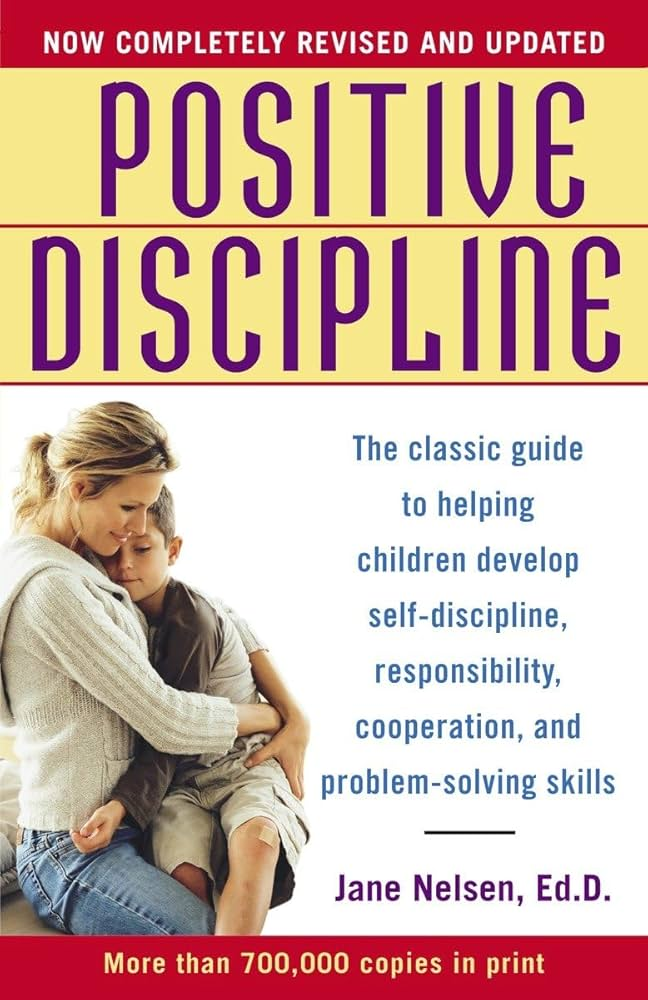

In "Positive Discipline," the "positive" doesn't mean face-to-face confrontation or being tough, but rather "not negative." It requires avoiding negative emotions, refraining from punishment, avoiding indulgence, while being kind and firm. This is incredibly challenging.

The hardest and most valuable part of parenting is not what you instill in your child but how you change yourself.

